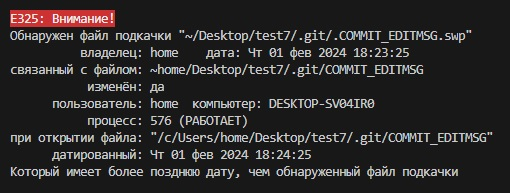

# ***Шпаргалка по Git и Markdown***

* # **Git.**
git version - вывод версии программы.   
git init - инициализация папки с файлами.   
git log - журнал изменений. 
git commit - тоздать точку восстановления.  
git add имя файла - добавить файл для сохранеия.  
git add . или git add all - добавить все файлы. 
git checkout +первые четыре символа - переключение между версиями.  
git branch - вывод ветвей   
git 
clear - очистка терминала   
продолжение следует

*не забывать использовать tab для ускорения заполнения команды.*

## *Ошибки*
1.
Удалить файл подкачки.

2. 

* # **Markdown**    
*Курсив*  * *  
**Полужирный**  ** **   
Заголовок #  перед текстом  
Заголовок меньшим текстом ##    
Список *  перед текстом     
Нумерованный список 1.  перед текстом

Ссылки  
[Markdoun] [https://ilfire.ru/kompyutery/shpargalka-po-sintaksisu-markdown-markdaun-so-vsemi-samymi-populyarnymi-tegami/?upm_export=print#link11]   
[Git][https://habr.com/ru/articles/541258/]